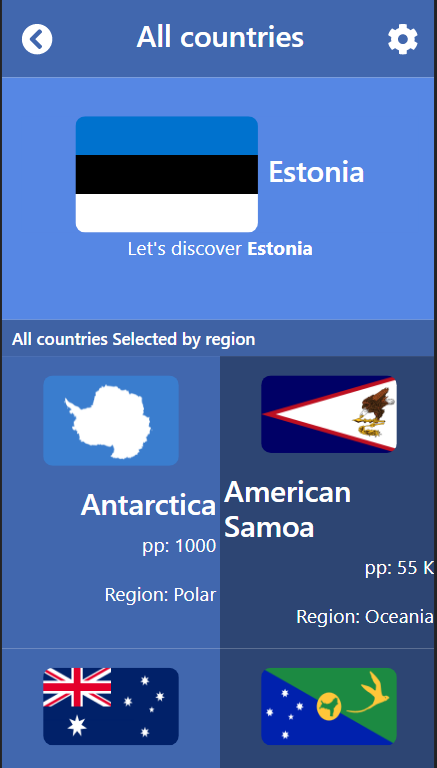
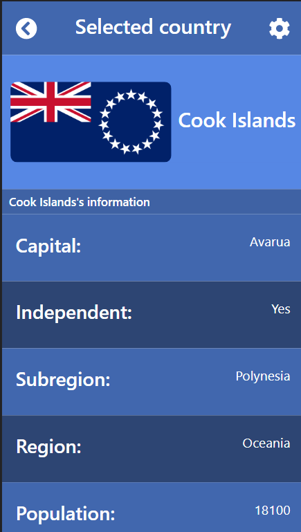

# Countries of all the World

This React capstone project is about building a mobile web application to check a list of metrics using React and Redux. 
I selected an API that provides numeric data about countries then I built the webapp around it. The webapp has several pages:
- Home page with a list of countries that could be filtered by some parameters(Region, population...) and a random country at the top.
- The detail page for the country details; in the screenshot, the detail page for the Cook Islands country with its information(Capital,  Population, Currency, Region...).

  

## Built with

- HTML/CSS
- React-Redux
- Node.JS
- REST Countries API

## Getting Started

If you want a copy of this file go to the github repository and download it from there

- [Countries of the World](https://github.com/ridaarif98/countries-of-the-world)

### Live

[LiveDemo](https://medaminedev66.github.io/countries-of-the-world/)

### Setup

```cmd
 git clone https://github.com/medaminedev66/countries-of-the-world
 cd countries-of-the-world
```

### Install

```cmd
npm install
npm run build
```

### Usage

```cmd
npm start
```

## Author

👤 **Amine Smahi**

- GitHub: [@medaminedev66](https://github.com/medaminedev66)
- Twitter: [@medaminesmahi](https://twitter.com/medaminesmahi)
- LinkedIn: [Mohammed Amine Smahi ](https://www.linkedin.com/in/mohammed-amine-smahi-1b8615187/)

=======

## 🤝 Contributing

Contributions, issues, and feature requests are welcome!

Feel free to check the [issues page](https://github.com/medaminedev66/countries-of-the-world/issues).

=======

## Show your support

Give a ⭐️ if you like this project!

=======

## Acknowledgments

- Microverse for giving me this chance
- The design template provider: [Nelson Sakwa on Behance](https://www.behance.net/sakwadesignstudio)
- To my Stand Up Team and coding partners who kept my morale up!
- The amazing code reviewers for making me improve every day :thumbsup:

=======
